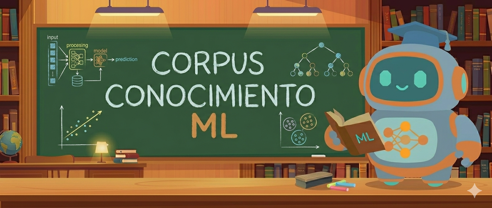

## ¿Qué encontrarás acá?

Este es un repositorio que tiene el propósito de recopilar material sobre temas de AI/ML/DL, dado que existen muchas fuentes de enseñanza súper buenas (como papers, libros y cursos) pero suelen ser de difícil acceso o el conocimiento de su existencia es limitado.

Por ello podrás encontrar aquí un corpus amplio con el que poder estudiar estas áreas en crecimiento.

## Libros

## Top 5 Libros Esenciales de AI / ML / DL

- [The Hundred-page Machine Learning Book](https://www.amazon.com/Hundred-Page-Machine-Learning-Book/dp/199957950X)  
  Un libro corto que ofrece una visión panorámica de los conceptos fundamentales del Machine Learning, lo que lo convierte en una excelente introducción al área. Ideal para obtener rápidamente un mapa general del campo antes de profundizar.

- [An Introduction to Statistical Learning](https://www.statlearning.com)  
  Un libro que aborda el Machine Learning desde una perspectiva estadística, explicando de manera clara los fundamentos que necesitas conocer. Cuenta con dos versiones: una basada en R y otra en Python, lo que lo hace muy accesible según tu lenguaje de preferencia.

- [Super Study Guide Transformers and Large Language Models](https://www.amazon.com/Super-Study-Guide-Transformers-Language/dp/B0DC4NYLTN)  
  Si ya comprendes la arquitectura básica de una red neuronal, este libro es ideal para avanzar hacia Transformers y modelos de lenguaje. Explica de forma didáctica e ilustrativa cómo funcionan, especialmente su componente central: la **atención**.

- [Deep Learning](https://www.deeplearningbook.org/)  
  El libro más completo y profundo sobre Deep Learning. Es denso pero exhaustivo, y cubre las matemáticas, la estadística y los algoritmos fundamentales que sustentan el estado del arte en Inteligencia Artificial.

- [Deep Learning - Foundations and Concepts](https://www.bishopbook.com)  
  Un enfoque moderno y altamente probabilístico del Deep Learning. Este libro reciente desarrolla rigurosamente la base matemática necesaria para comprender desde los fundamentos el esquema general del aprendizaje profundo.

---

[La lista de todos los libros](collections/books.md)

---

## Top 5 Cursos Esenciales de AI / ML / DL

- [Mathematics for Machine Learning and Data Science Specialization](https://www.deeplearning.ai/courses/mathematics-for-machine-learning-and-data-science-specialization/)  
  El punto de partida ideal. Esta especialización cubre las matemáticas fundamentales para IA: álgebra lineal, cálculo, probabilidad y optimización. Si quieres entender realmente lo que ocurre detrás de los modelos, comienza aquí.

- [Machine Learning Specialization](https://www.deeplearning.ai/courses/machine-learning-specialization/)  
  Una base sólida en Machine Learning clásico: regresión, clasificación, clustering y métodos de ensamble. Construye la intuición necesaria antes de profundizar en redes neuronales avanzadas.

- [Deep Learning Specialization](https://www.deeplearning.ai/courses/deep-learning-specialization/)  
  Una de las especializaciones más reconocidas en Deep Learning. Cubre redes neuronales profundas, optimización, CNNs, RNNs y técnicas modernas fundamentales en IA.

- [Hugging Face — Agents Course](https://huggingface.co/learn/agents-course/unit0/introduction)  
  Una introducción moderna al desarrollo de agentes inteligentes y aplicaciones con modelos de lenguaje. Ideal para entender el paradigma actual de sistemas autónomos y LLM-powered agents.

- [Machine Learning in Production](https://www.deeplearning.ai/courses/machine-learning-in-production/)  
  El paso final: aprender a llevar modelos a producción. Incluye despliegue, monitoreo, escalabilidad y buenas prácticas para sistemas de ML en entornos reales.

---

[La lista completa de cursos recomendados](collections/courses.md)

---

## Top 5 Sitios Web Recomendados para AI / ML / DL

- [Kaggle](https://www.kaggle.com)  
  Una de las plataformas más importantes para practicar Data Science y Machine Learning con **datasets reales**, competencias, notebooks colaborativos y un entorno interactivo para aprender haciendo.

- [Deep-ML Problems](https://www.deep-ml.com/problems)  
  Sitio con una colección de **problemas prácticos y ejercicios** de machine learning y deep learning para practicar tus habilidades resolviendo retos concretos.

- [Intro to Data Analysis](https://michael-franke.github.io/intro-data-analysis/index.html)  
  Recurso interactivo y accesible para aprender análisis de datos desde cero, con visualizaciones, ejercicios y explicaciones claras de conceptos básicos.

- [Building an LLM From Scratch in Rust](https://www.tag1.com/how-to/part1-tokenization-building-an-llm-from-scratch-in-rust/)  
  Guía técnica paso a paso enfocada en **tokenización y construcción de un LLM** desde cero usando Rust. Excelente si te interesa entender internals de modelos de lenguaje y arquitectura de sistemas eficientes.

- [Stanford — Intro to Deep Learning (Shervine)](https://stanford.edu/~shervine/l/es/teaching/)  
  Material educativo de cursos de Stanford enfocados en deep learning y machine learning, con explicaciones didácticas y ejercicios estructurados.

---

[La lista completa de websites recomendados](collections/websites.md)

